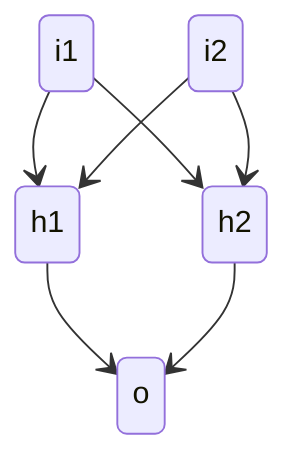
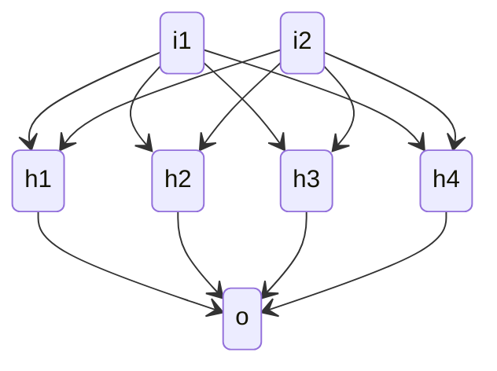

# Notes

My very unprofessional testing (I just run the project couple of times to see) of the first XOR network prototype.

Simple network topology, just a **single hidden layer** with two neurons:

| Number of training inputs | Epochs | Learning rate | Outcome                                                      |
| ------------------------: | -----: | ------------: | ------------------------------------------------------------ |
|                       100 |  5 000 |           0.1 | Sometimes there are big errors (30-70%)                      |
|                       100 | 10 000 |           0.1 | I still see ~50% errors pretty often. Not much more than that though. Sometimes it's perfect, sometimes the error hovers around ~20% for some inputs |
|                      1000 |  5 000 |           0.1 | Gets ~0% error most of the time, but sometimes spikes to ~50% |
|                      1000 |  5 000 |       **0.5** | **Much better.** 0% almost every time, but I saw it spike to ~50%. I guess the learning rate matters, huh. |

## More neurons

Just having 4 hidden neurons improves the results dramatically! Seems like. I guess that's not that surprising.

| Inputs | Epochs | Learning rate | Outcome                                                      |
| -----: | -----: | :-----------: | ------------------------------------------------------------ |
|    100 |  5 000 |      0.5      | **I haven't seen it miss.** I've gone back to the 100 inputs, so the training is still very quick. |

